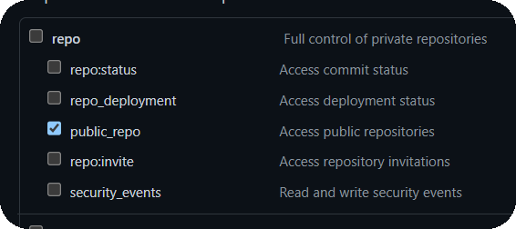
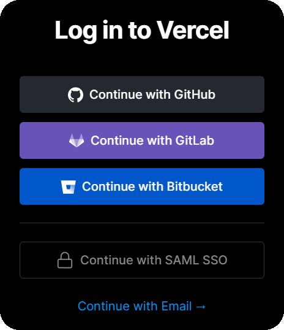
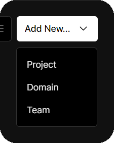
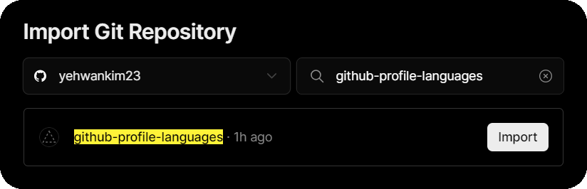
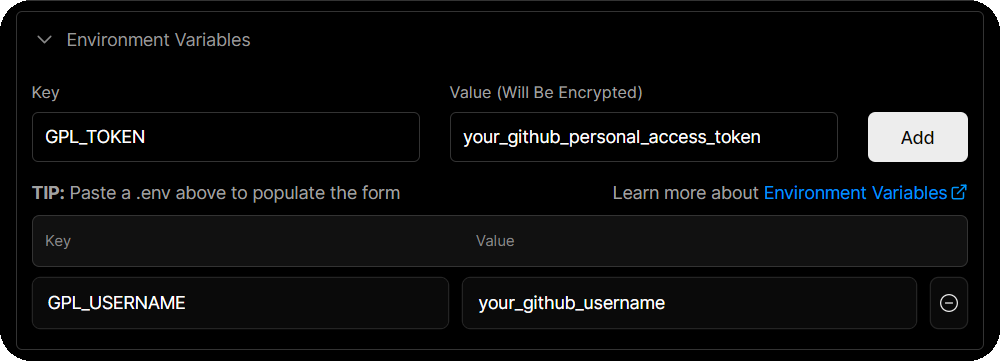
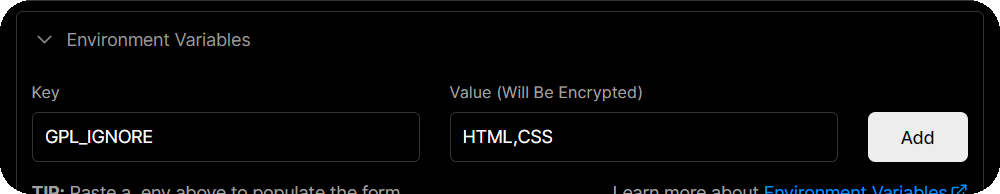
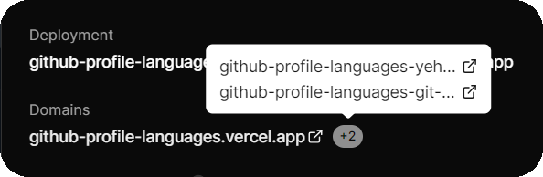
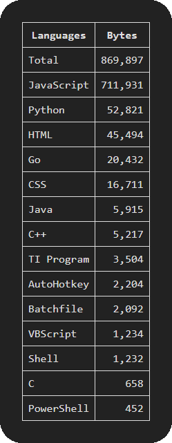
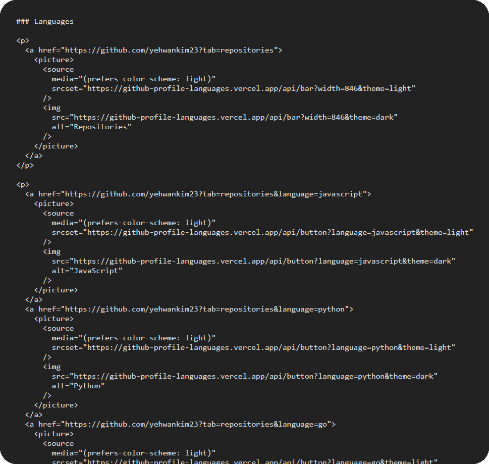

# GitHub Profile Languages

API that generates GitHub-themed SVGs that show the percentage of a language in public repositories

Inspired by [GitHub Readme Stats](https://github.com/anuraghazra/github-readme-stats) and [Shields.io](https://github.com/badges/shields)

## Preview

[My GitHub profile README](https://github.com/yehwankim23/yehwankim23)

### Dark Themes

Language Bar:


Language Button (default, high contrast, dimmed):


### Light Themes

Language Bar:


Language Button (default, high contrast):


## Deployment

1. [Fork this repository](https://github.com/yehwankim23/github-profile-languages/fork)

2. [Generate a GitHub personal access token](https://github.com/settings/tokens/new) with `public_repo` permission



3. Go to [Vercel](https://vercel.com/login) and `Continue with GitHub`



4. Click `Add New...` > `Project`



5. Find your repository and click `Import`



6. Click `Environment Variables` and add `GPL_TOKEN` and `GPL_USERNAME`



7. (Optional) Add languages that you want to ignore as comma-separated values (no spaces)

> [Supported languages](/src/languages.js)



8. Click `Deploy`

9. Click `Continue to Dashboard`

10. Check your domains under `DOMAINS`



## Usage

### Language Bar

Copy and paste the following Markdown and change `DOMAIN`, `WIDTH`, and `THEME`

> [Supported themes](/src/themes.js)

```md

```

Example:

- `DOMAIN` → `https://github-profile-languages.vercel.app`
- `WIDTH` → `830`
- `THEME` → `dark`

```md

```

Result:


### Language Button

Copy and paste the following Markdown and change `DOMAIN`, `LANGUAGE`, and `THEME`

> [Supported languages](/src/languages.js)

> [Supported themes](/src/themes.js)

```md

```

Example:

- `DOMAIN` → `https://github-profile-languages.vercel.app`
- `LANGUAGE` → `C%2b%2b` ([Percent-encoded](#percent-encoding) "C++")
- `THEME` → `dark`

```md

```

Result:


### Language Stats

Visit `DOMAIN/api/stats` for raw language statistics

Example:

- `DOMAIN` → `https://github-profile-languages.vercel.app`

[https://github-profile-languages.vercel.app/api/stats](https://github-profile-languages.vercel.app/api/stats)

Result:



### README Generator

Visit `DOMAIN/api/readme` to generate a README file

Example:

- `DOMAIN` → `https://github-profile-languages.vercel.app`

[https://github-profile-languages.vercel.app/api/readme](https://github-profile-languages.vercel.app/api/readme)

Result:



### Percent-encoding

| ASCII | 2x  | ASCII | 3x  | ASCII | 4x  | ASCII | 5x  | ASCII | 6x  | ASCII | 7x  |
| ----- | --- | ----- | --- | ----- | --- | ----- | --- | ----- | --- | ----- | --- |
| space | %20 | :     | %3a | @     | %40 | [     | %5b | `     | %60 | {     | %7b |
| !     | %21 | ;     | %3b |       |     | \     | %5c |       |     | \|    | %7c |
| "     | %22 | <     | %3c |       |     | ]     | %5d |       |     | }     | %7d |
| #     | %23 | =     | %3d |       |     | ^     | %5e |       |     | ~     | %7e |
| $     | %24 | >     | %3e |       |     | \_    | %5f |
| %     | %25 | ?     | %3f |
| &     | %26 |
| '     | %27 |
| (     | %28 |
| )     | %29 |
| \*    | %2a |
| +     | %2b |
| ,     | %2c |
| -     | %2d |
| .     | %2e |
| /     | %2f |
